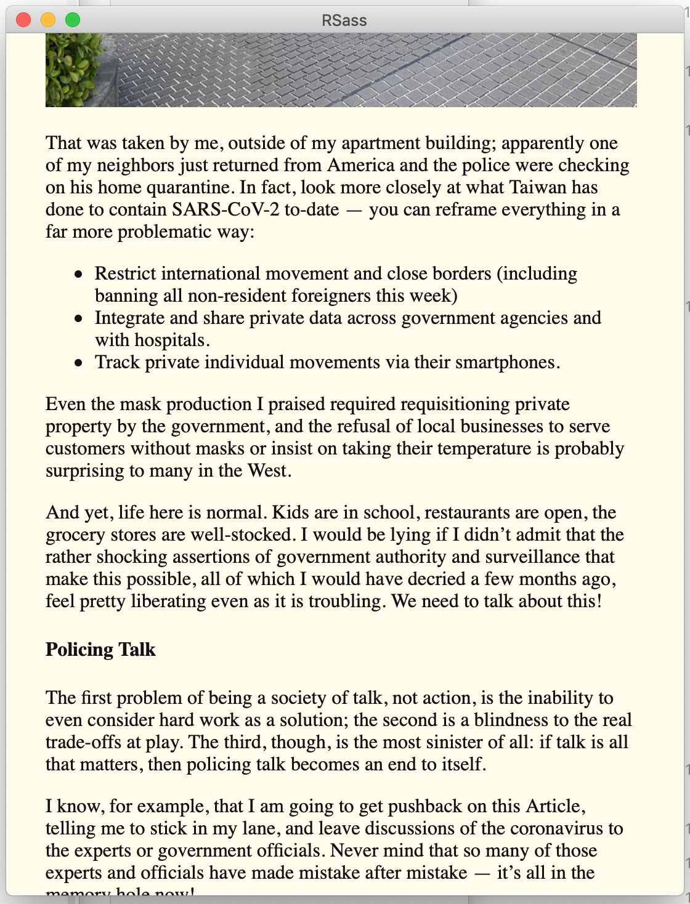

# RSass

RSass is a small RSS reader that was written out of annoyance with Feedly.

It does not have a lot of features, it is just a tiny, hacked-together thing,
and it barely works. Right now, it runs via `cargo run` -- it's not even close
to being usable.

## Core concepts

### File-based

Like many stalwarts of *nix, this is entirely controlled via a file, in this
case `~/.rsass/feeds.toml`. Everything is kept in this file, and you add more
feeds by modifying that file.

### No servers or daemons.

Feeds are fetched on startup. This may eventually change, simply because it's
slow as hell.

### No selective reading.

This is conceived as a "reading queue" of RSS -- You read all of it, one article
after the next. There is no selection list, and it assumes that you want to
consume all of the content in your RSS feeds.

## Additional niceties.

### OPML import

Once I get around to wiring it up to a CLI, there's a OPML importer alreayd
written that will jump-start your `feeds.toml`.

# Contributing

I welcome any patch to make this thing better, because I do want to use it as
primary RSS reader. If you're not sure what to work on, file an issue with
something that annoys you about using it, and we'll chat about the best way to
fix it.

Licensed under the GPL v3.
